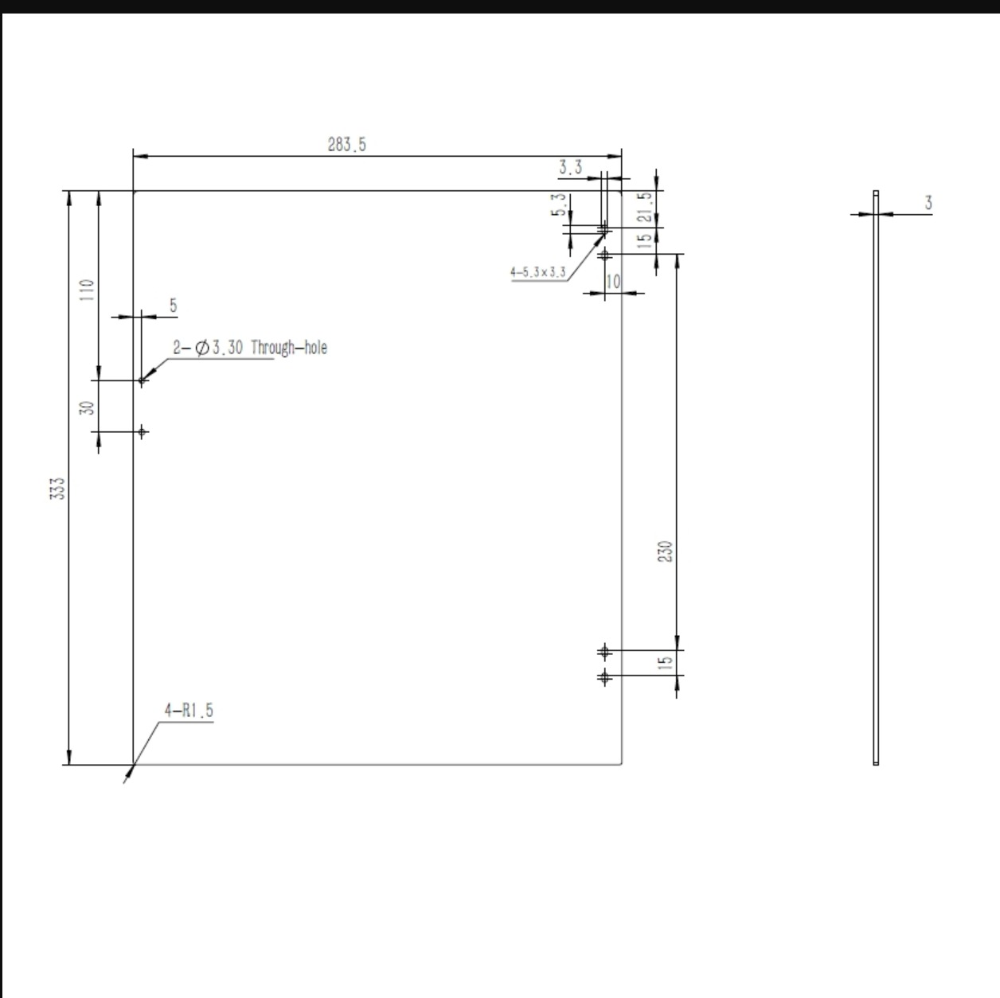
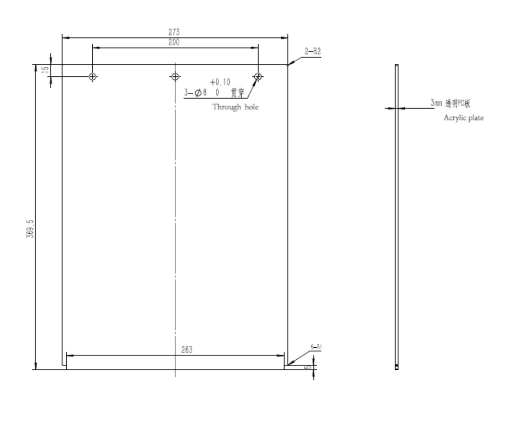
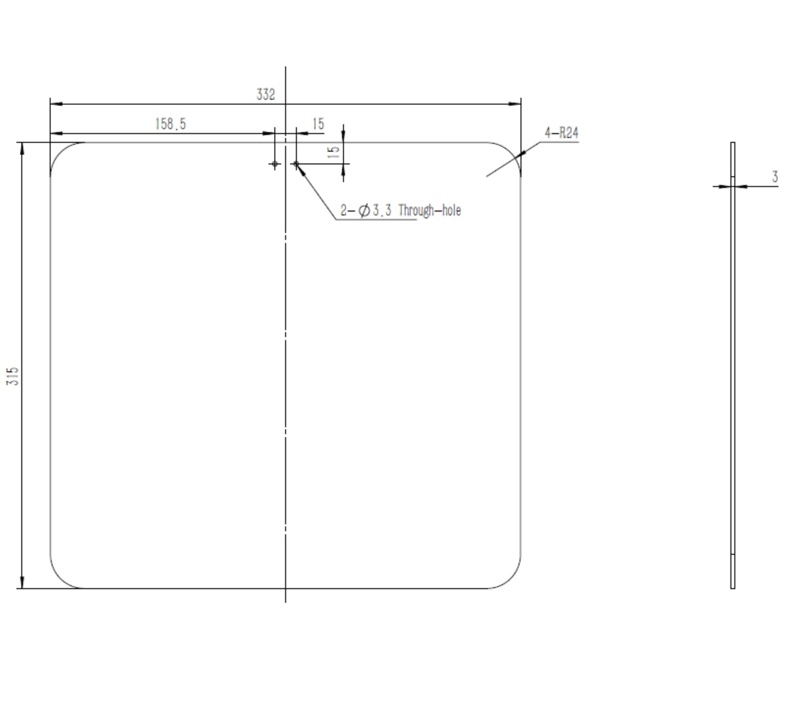
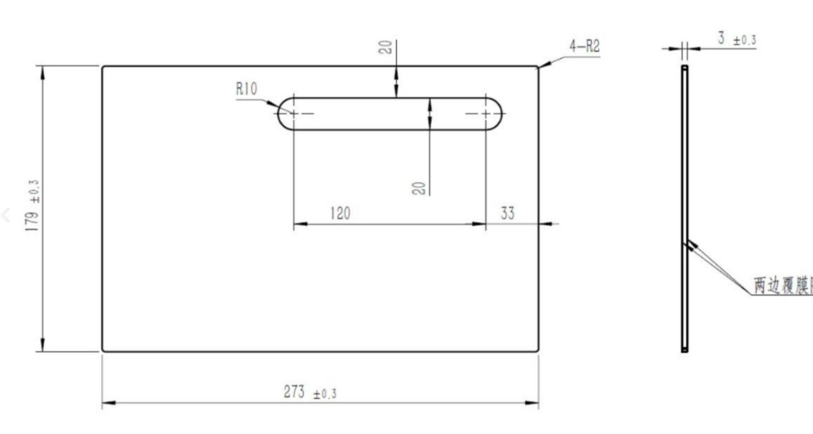
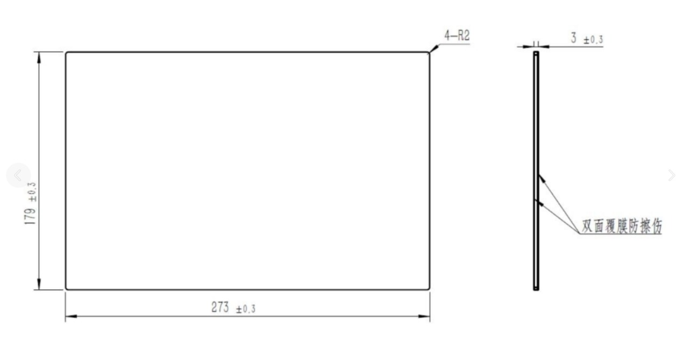
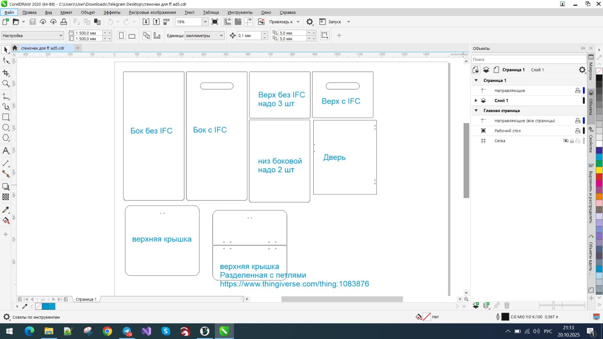

> [← Оглавление](index.md)

# AD5X: Корпус и Панели (Enclosure)

## Оглавление
1. [Официальная документация и модели](#1-официальная-версия-от-flashforge)
2. [Боковые панели](#2-боковые-панели)
3. [Увеличенная надстройка (Акрил +30мм)](#3-файлы-резки-акрила-увеличенная-высота)
4. [Мод корпуса от Сергея (+50мм)](#4-модификация-от-сергея-50-мм)

---

## 1. Официальная версия от Flashforge
Оригинальные файлы для печати кузовных деталей и инструкции от производителя.

* **Ссылка:** [Flashforge Wiki - Printed Parts](https://wiki.flashforge.com/en/ad5x/Files_for_printed_parts)

---

## 2. Боковые панели
Чертежи и внешний вид боковых панелей.

---

## 3. Файлы резки акрила (Увеличенная высота)
Комплект чертежей для лазерной резки акрила. Данная модификация увеличивает высоту верхней части принтера на **30 мм** относительно стока, что необходимо для более удобной укладки трубки Боудена и кабеля головы.

* **Скачать чертежи (CDR):** [Ссылка на архив](https://github.com/lDOCI/Flashforge/releases/download/Adventurer/ff.ad5.cdr)
* **Скачать чертежи (DXF):** [Ссылка на архив](https://github.com/lDOCI/Flashforge/releases/download/Adventurer/ff.ad5.dxf)

**Схема сборки:**

---

## 4. Модификация от Сергея (+50 мм)
Комплексное решение для значительного увеличения внутреннего объема камеры.

**Характеристики подъема:**
* Верхние стойки: **+30 мм**
* Крепление верхней крышки: **+20 мм**
* **Итоговый прирост высоты: +50 мм**

**Важное дополнение (Cable Management):**
В архиве находится файл `Kreplenie` — S-образный зажим для кабеля головы.
* **Назначение:** Заменяет стоковый фиксатор (склонен к поломкам).
* **Важность:** Жесткая фиксация кабеля критически важна для корректной работы акселерометра. Свободно болтающийся кабель искажает показания при калибровке Input Shaper (резонансы).

**Файлы:**
* **Скачать модели (STL) и чертежи:** [Ссылка на архив](https://github.com/lDOCI/Flashforge/releases/download/Adventurer/enclosure.zip)

[Наверх](#оглавление)
