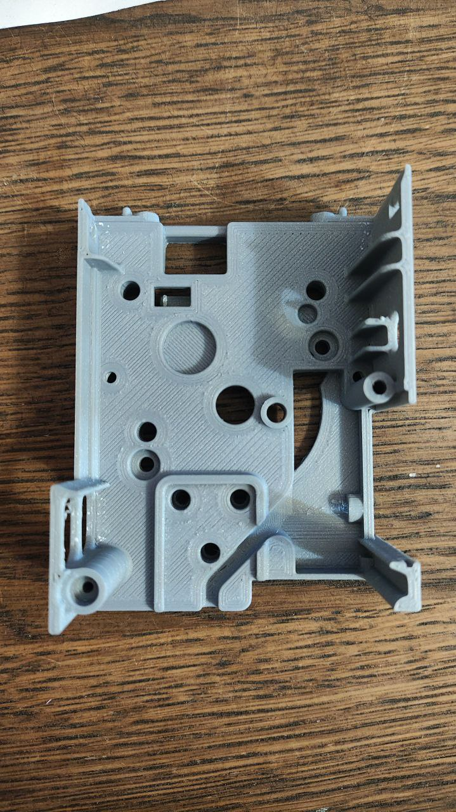
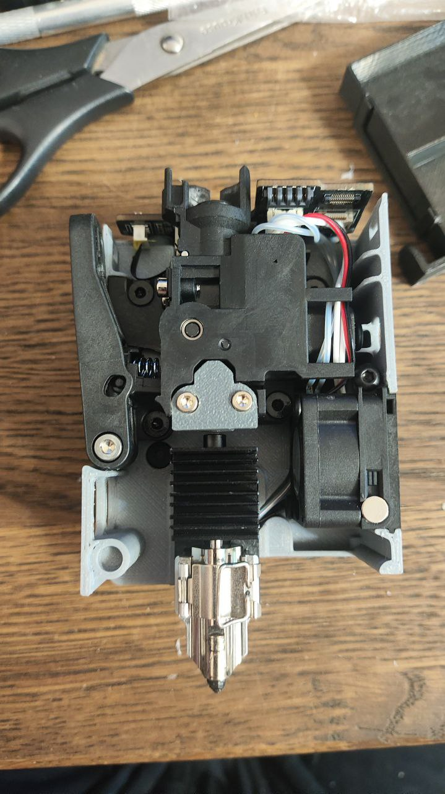
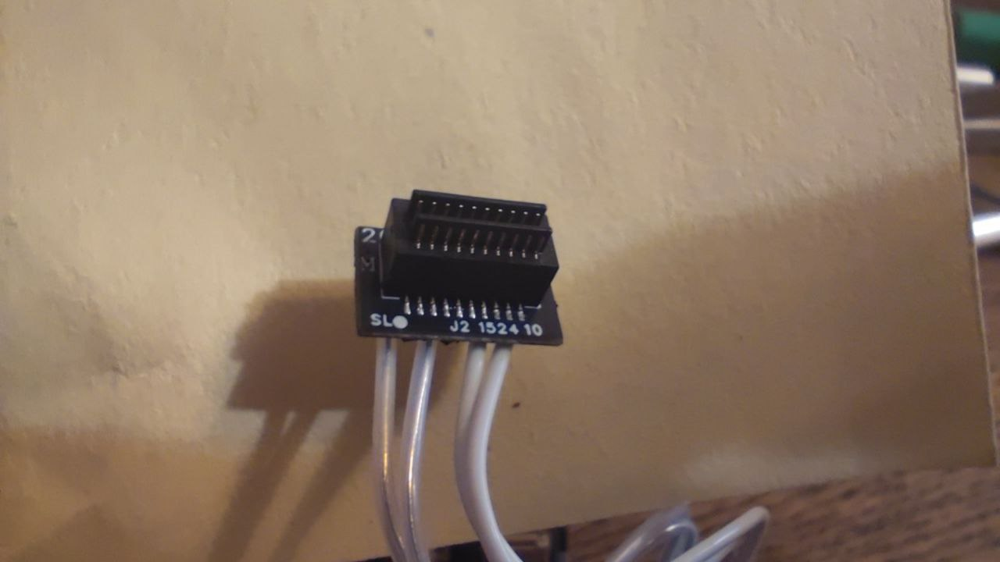
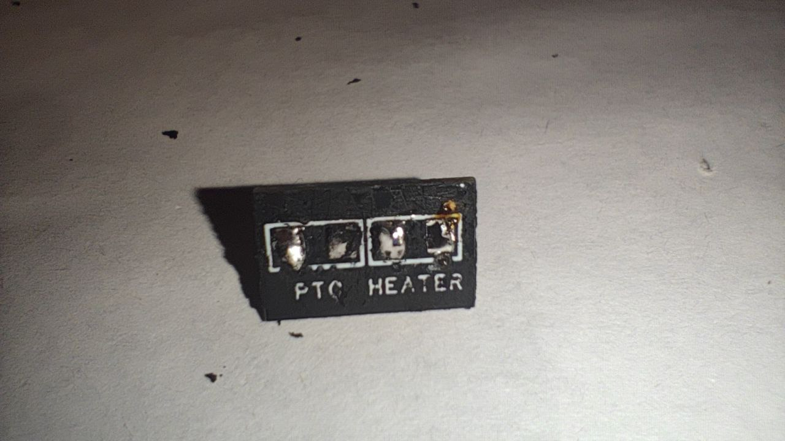
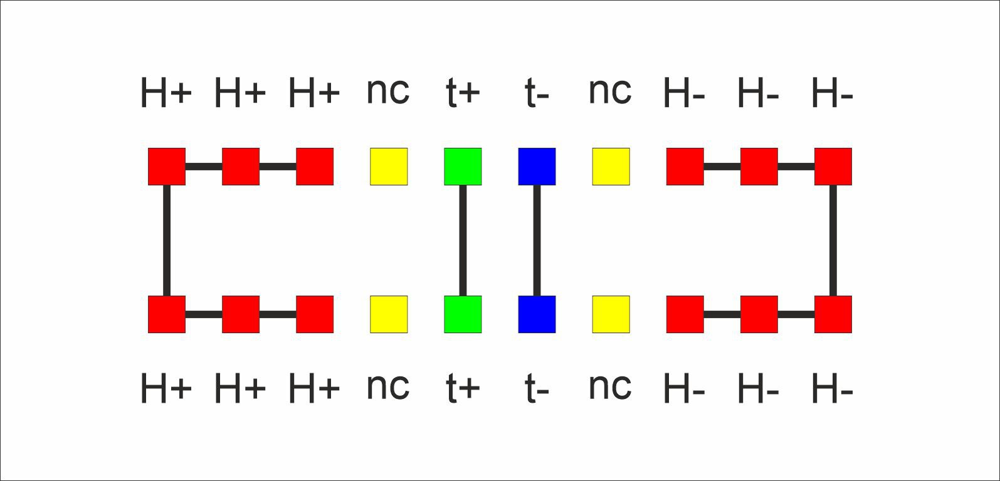
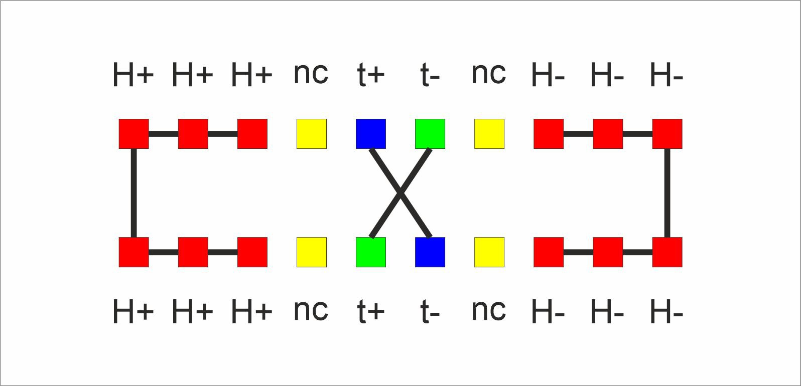

> [← Оглавление](index.md)

# AD5X: Печатные модификации (Mods)

В данном разделе собраны пользовательские модификации (STL-модели) для улучшения функционала принтера.

**Общие рекомендации:**
* Детали, контактирующие с горячими зонами или находящиеся внутри термокамеры, рекомендуется печатать из термостойких пластиков.

## Оглавление
1. [Каретка под Bambu Lab Hotend (Полная замена)](#1-каретка-под-bambu-lab-hotend-bambu-mod)
2. [Адаптер Bambu Hotend для стоковой каретки](#2-адаптер-bambu-hotend-для-стоковой-каретки)
3. [Вынос кнопки питания на лицевую панель](#3-вынос-кнопки-питания-на-лицевую-панель)
4. [Печатная крышка обдува](#4-печатная-крышка-обдува)
5. [Улучшенный филамент-хаб](#5-улучшенный-филамент-хаб)

---

## 1. Каретка под Bambu Lab Hotend (Bambu Mod)
Полная замена стоковой каретки для установки нагревателя и хотенда от Bambu Lab.
Доступны две версии модели:
1. **Standard:** С цельным основанием.
2. **Lightweight:** Облегченная версия.

### Спецификация крепежа (BOM)
Для сборки требуются вплавляемые гайки (heat-set inserts) и магнит:
* **М3 х 4 х 4.5 мм** — 7 шт. (Крепление фидера и нагревателя).
* **М3 х 5 х 4.5 мм** — 4 шт. (Крепление каретки к принтеру).
* **Магнит 5 х 3 мм** — 1 шт. (Датчик филамента).

### Электрическая совместимость
Разъём нагревателя Bambu Lab имеет иную распиновку, несовместимую с платой Flashforge.
**Необходимо перепаять разъём**, используя коннектор от оригинального нагревателя AD5X.

* **Схема/Фото распиновки:**
 
 
 
 

### Файлы
* **Скачать FF_AD5X_Bambumod:** [Ссылка на файл](https://github.com/lDOCI/Flashforge/releases/download/Adventurer/FF_AD5X_Bambumod.STEP)
* **Скачать FF_AD5X_Bambumod Lite:** [Ссылка на файлы](https://github.com/lDOCI/Flashforge/releases/download/Adventurer/FF_AD5X_Bambumod_Lite.STEP)

[Наверх](#оглавление)

---

## 2. Адаптер Bambu Hotend для стоковой каретки
Переходник, позволяющий установить хотенд Bambu Lab без полной замены каретки.

* **Скачать STL:** [Ссылка на файл](https://github.com/lDOCI/Flashforge/releases/download/Adventurer/ad5x_._v2.0.stl)

---

## 3. Вынос кнопки питания на лицевую панель
Комплект моделей для переноса штатного выключателя с задней стенки на переднюю для удобства доступа.
Включает в себя:
1. Корпус для кнопки (Лицевая панель).
2. Заглушка (На штатное место сзади).

### Безопасность (Важно)
При удлинении проводки необходимо полностью сохранить схему подключения, включая предохранитель. Разрывать только фазу или только ноль без соответствующей защиты — **небезопасно**. Рекомендуется использовать качественные провода соответствующего сечения и клеммы.

* **Скачать модель:** [Кронштейн кнопки](https://github.com/lDOCI/Flashforge/releases/download/Adventurer/button.bracket.stl)
* **Скачать модель:** [Заглушка кнопки](https://github.com/lDOCI/Flashforge/releases/download/Adventurer/button.cover.stl)

---

## 4. Печатная крышка обдува
Альтернативная версия воздуховода (fan duct) для охлаждения детали.

* **Скачать STEP:** [Ссылка на файл](https://github.com/lDOCI/Flashforge/releases/download/Adventurer/AD5X_cooling_fan_duct_mod.STEP)

---

## 5. Улучшенный филамент-хаб
Модифицированный разветвитель (хаб) для подачи пластика.
* **Особенности:** Оптимизированный канал прохождения прутка (минимизация трения и застреваний).
* **Совместимость:** Рассчитан на версию с новым креплением.
* **Материал:** Строго ABS/ASA (деталь находится в горячей зоне).

* **Скачать STL:** [Ссылка на файл](https://github.com/lDOCI/Flashforge/releases/download/Adventurer/hub.stl)

[Наверх](#оглавление)
