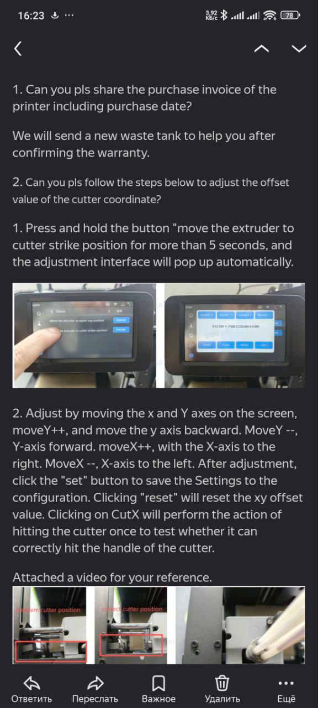

> [← Оглавление](index.md)

# AD5X: Прошивка и Калибровка

## Оглавление
1. [Восстановление координат парковки (Home Offset)](#1-восстановление-координат-парковки-сбой-home)
2. [Настройка положения отрезки филамента](#2-настройка-положения-отрезки-филамента)
3. [Регулировка корзины (IFS) через инженерное меню](#3-регулировка-положения-корзины)

---

## 1. Восстановление координат парковки (Сбой Home)
Применяется в случаях, когда печатающая голова сместилась и промахивается мимо лотка сброса пластика (purge chute). Утилита предоставлена официальной поддержкой Flashforge.

* **Скачать сервисный скрипт:** [Ссылка на архив](https://github.com/lDOCI/Flashforge/releases/download/Adventurer/Set.XY.Offset.zip)

**Инструкция по применению:**
1. Распаковать скачанный архив в корень USB-флешки.
2. Вставить флешку в принтер и перезагрузить его.
3. Автоматически запустится меню калибровки.
4. Нажать кнопку **Reset** (Сброс).
5. Используя стрелки на экране, выставить голову в корректную позицию над лотком.
6. Нажать кнопку **Set** для сохранения новых координат.
7. Извлечь флешку и перезагрузить принтер.

---

## 2. Настройка положения отрезки филамента
Официальная инструкция по изменению координат срабатывания ножа для обрезки пластика. Позволяет устранить проблемы с недорезанием или заклиниванием при смене филамента.

[Видео](https://github.com/lDOCI/Flashforge/releases/download/Adventurer/video_2026-02-02_01-35-21.mp4)

---

## 3. Регулировка положения корзины
Настройка позиционирования механизма смены филамента (корзины) на стоковой прошивке через скрытое инженерное меню (как в него войти: на экране «i» → удерживать заголовок «Информация о машине» 10+ сек, см. [Изменение конфига](Прошивка.md#изменение-конфига)).

* **Инструкция в базе знаний ZMOD:** [Открыть на GitHub](https://github.com/ghzserg/zmod/wiki/AD5X#%D0%BD%D0%B0%D1%81%D1%82%D1%80%D0%BE%D0%B9%D0%BA%D0%B0-%D0%BA%D0%BE%D1%80%D0%B7%D0%B8%D0%BD%D1%8B-%D0%BD%D0%B0-%D1%80%D0%BE%D0%B4%D0%BD%D0%BE%D0%B9-%D0%BF%D1%80%D0%BE%D1%88%D0%B8%D0%B2%D0%BA%D0%B5-ad5x)

[Наверх](#оглавление)
