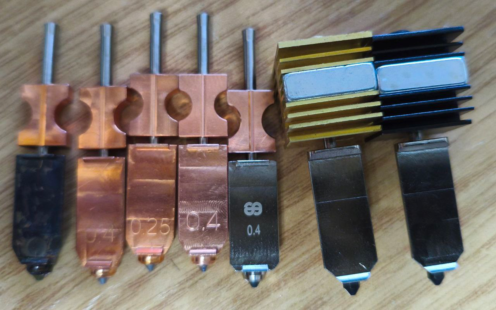
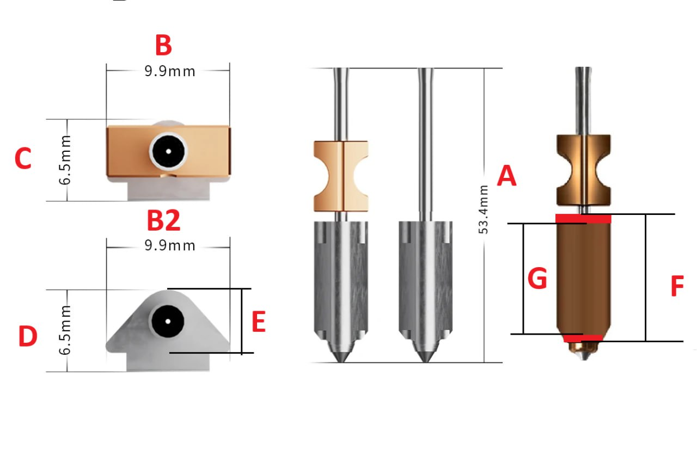

> [← Оглавление](index.md)

# AD5X: Реверс и Железо

## Оглавление
1. [Система IFS (Схемы и ПО)](#система-ifs)
2. [Размеры хотендов](#размеры-хотендов)
3. [Замеры и ссылки на сопла](#замеры-и-ссылки-на-сопла)

---

## Система IFS
Документация и программное обеспечение для системы автоматической смены филамента (IFS).

* **Принципиальная схема IFS:** [Скачать PDF](https://github.com/lDOCI/Flashforge/releases/download/Adventurer/ifs_shema.pdf)
* **Бекап прошивки IFS (v3.0.6):** [Скачать дамп](https://github.com/lDOCI/Flashforge/releases/download/Adventurer/ifc_3.0.6_becup.hex)
* **Расшифровка протокола IFS:** [Скачать таблицу XLSX](https://github.com/lDOCI/Flashforge/releases/download/Adventurer/_._ifc_._._3_0_1.xlsx)

[Наверх](#оглавление)

---

## Размеры хотендов
Чертежи и сравнительные размеры доступных на рынке хотендов.

**Детальные размеры:**

[Наверх](#оглавление)

---

## Замеры и ссылки на сопла
Справочная информация по совместимым соплам и ссылки на проверенных продавцов.

1. **Оригинальное Flashforge 0.4** (Пробег 34 часа)
2. **JUUPINE 0.4** — [Купить на AliExpress](https://aliexpress.ru/item/1005009435630400.html)
3. **JUUPINE 0.25** — [Купить на AliExpress](https://aliexpress.ru/item/1005009435630400.html)
4. **OZON 0.4** (Комплект насадок) — [Купить на Ozon](https://www.ozon.ru/product/komplekt-nasadok-dlya-bystrosemnogo-ekstrudera-flashforge-ad5x-s-nasadkoy-0-4-mm-2795270946/)
5. **BLV 0.4** — [Купить на AliExpress](https://aliexpress.ru/item/1005010213537957.html)
6. **Conch 0.4** — [Купить на AliExpress](https://aliexpress.ru/item/1005009953549402.html)
7. **Bambu Lab Clone (Вариант 1)** — [Купить на AliExpress](https://aliexpress.ru/item/1005008579565642.html)
8. **Bambu Lab Clone (Вариант 2)** — [Купить на AliExpress](https://aliexpress.ru/item/1005006850870969.html)

[Наверх](#оглавление)
